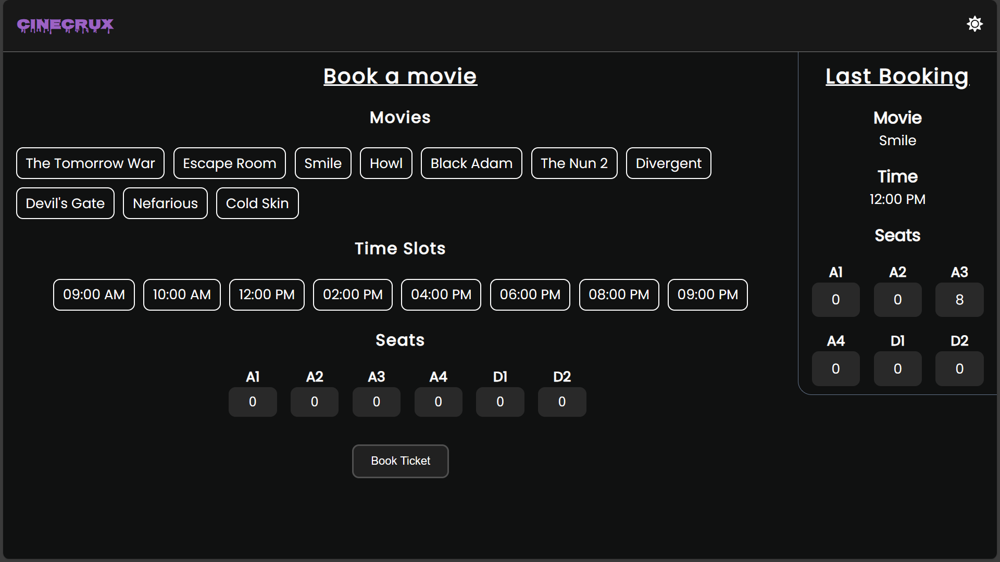
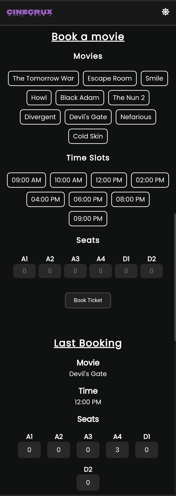

# CineCrux - Book Movie Tickets


## Deployment URL

- **Front-End: [https://cinecrux.vercel.app](https://cinecrux.vercel.app)**
- **Back-End: [https://cinecrux-api.vercel.app](https://cinecrux-api.vercel.app)**

A sleek and responsive Movie Booking App built with the MERN stack technology. This app seamlessly integrates MongoDB, Express.js, React.js, and Node.js, providing users with an efficient movie booking experience. With a user-friendly interface in React, users can easily browse, select, and book their preferred movies. The app uses MongoDB for data storage, ensuring a streamlined process. Leveraging Express.js and Node.js, it enables seamless communication between the front and back end. The last booked movie is displayed prominently, offering users a quick reference.

## Screenshots

### Large Device



### Small Device



## Features:

- **Book Movie Tickets:** Easily book movie tickets through an intuitive and user-friendly interface.

- **View Last Booked Movie:** Quickly access information about the most recently booked movie.

- **Sleek and Responsive UI:** Experience a modern and responsive user interface that adapts smoothly to different devices.

## Technologies Used

- **MongoDB:** MongoDB serves as the database for CineCrux, providing a flexible and scalable solution for storing booking data. Its NoSQL nature allows for efficient handling of diverse data types.

- **Express.js:** Express.js forms the backbone of the backend server, providing a robust and minimalist framework for building web applications and APIs. It handles routing, middleware, and HTTP requests, ensuring smooth communication between the frontend and the database.

- **React.js:** React is the heart of the frontend, empowering the creation of interactive and dynamic user interfaces. Its component-based architecture facilitates modular development, enhancing code reusability and maintainability.

- **Node.js:** Node.js powers the runtime environment for the server-side code, ensuring efficient handling of concurrent requests.

## How to Run

1. **Clone the Repository:**

   ```bash
   git clone https://github.com/mskp/movie-booking-app
   ```

2. **Install the dependencies:**

   ```bash
   npm i
   cd client && npm i
   cd server && npm i
   ```

3. **Running the Project Locally:** Navigate to the project's root directory and run the following commands

   ```bash
   # Run the express server
   npm run server

   # Run the react server
   npm run client
   ```

   **OR**

   ```bash
   # Run both servers concurrently
   npm run dev
   ```

4. **Open the following URLs in your browser:** http://localhost:3000 for the frontend and http://localhost:8080 for the backend.

## API Documentation

Explore the API endpoints and understand how to interact with the CineCrux backend.

- **Postman Documentation:** [https://documenter.getpostman.com/view/31476421/2s9YeG7CT3](https://documenter.getpostman.com/view/31476421/2s9YeG7CT3)

## Developer

- **Name:** Sushant Pandey
- **GitHub:** [https://github.com/mskp](https://github.com/mskp)
- **LinkedIn:** [https://www.linkedin.com/in/sushaantkp/](https://www.linkedin.com/in/sushaantkp/)
- **Email:** sushhantpandey@gmail.com

## License

This repository is MIT licensed. [Read more](./LICENSE.txt)
